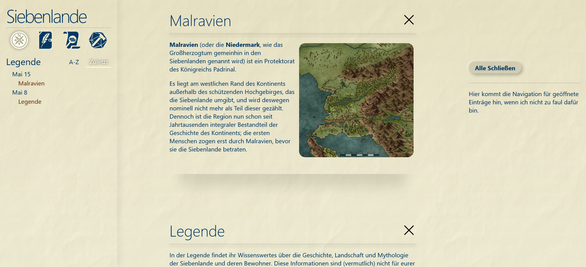

# Siebenlande
Repository of the site https://sculeru.de. Very simple react app intended to be a static webviewer of an Obsidian knowledgebase.



## Knowledgebase

Open `/app/public/kb` as an [obsidian.md](https://obsidian.md) vault.

### Update KB Index
Necessary to tell the app which files are available.    
```bash
python indexer.py
```

## Installation

```bash
cd app
npm install
```
All further commands are executed in the `app` directory.

## Usage

```bash
npm start
```

## Build

```bash
npm run build
```